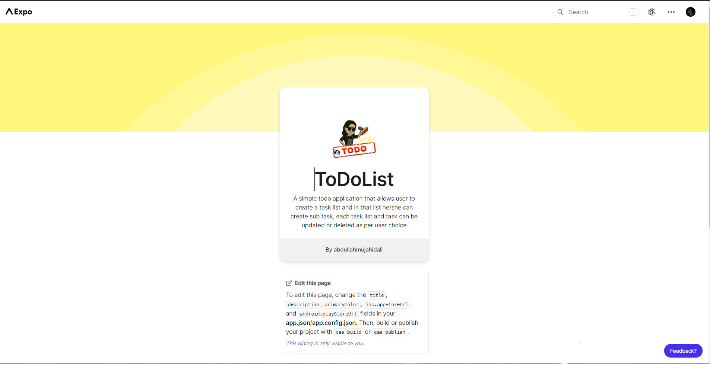

#  TO DO APP (React Native)

[](https://github.com//abdullahmujahidali/ToDoApp-Project-RN-)
[](https://opensource.com/users/abdullahmujahidali)
[](https://www.python.org/)
[](https://github.com/abdullahmujahidali//abdullahmujahidali/ToDoApp-Project-RN-/blob/master/LICENSE)
[](https://github.com/abdullahmujahidali)
[](https://twitter.com/abdulladgaf)

Please consider following this project's author, [Abdullah Mujahid](https://github.com/abdullahmujahidali), and consider starring the project to show your :heart: and support.


# THIS APPLICATION IS OFFICIALLY PUBLISHED ON EXPO FOR BOTH ANDROID AND IOS USER
## LINK: https://expo.io/@abdullahmujahidali/projects/ToDoList

### EXPO PUBLISHED




## Built With REACT NATIVE 

* [React JS](https://reactjs.org/)
* [React Native](https://expressjs.com/)


## Project Features.
* User can create a to do task list
* User can add sub tasks in the list adding its priority, labels, title and a status of complete.
* User can create a task.
* User can delete a task.
* User can view a task.
* User can set priority of a task.


## Prerequisites
* Node JS
* React JS
* Expo CLI


## Steps to run this application
* Clone:
```bash
        ∧∧
　　 ( ´◔ω◔`)　＜・・・・・・ $ git clone https://github.com/abdullahmujahidali/ToDoApp-Project-RN-
　 ＿|　⊃／(＿＿
／　└-(＿＿＿_／
￣￣￣￣￣￣￣

　＜⌒／ヽ-､＿＿ 　 　　*thanks
／＜_/＿＿＿＿／

```


## How to run this application.
* Clone this repo
* In the root directory of this project open terminal and enter run `npm install`. This will install all the packages necessary for the application
* In order to run the app you must have expo installed and run either `npm start` or you can run it with `expo start` there are a number of other ways too in order to run this application like `expo start --android` for Android AVD `expo start --ios` for iOS AVD.
* Now navigate to `http://localhost:19002/` for expo cli to view the Metro Builder


# SCREENSHOTS OF USER INTERFACE

## SPLASH SCREEN
### (IOS)


### (ANDROID)


## HOME SCREEN
### (IOS)


### (ANDROID)


## CREATE SCREEN
### (IOS)


### (ANDROID)


## VIEW TASK LIST SCREEN
### (IOS)


### (ANDROID)


## VIEW EDIT/DELETE SCREEN
### (IOS)


### (ANDROID)


### Author

**Abdullah Mujahid**

* [LinkedIn Profile](https://https://www.linkedin.com/in/abdullah-mujahid-211849186/)
* [GitHub Profile](https://github.com/abdullahmujahidali)
* [Twitter Profile](https://twitter.com/abdulladgaf)

### License
Copyright © 2021, [Abdullah Mujahid](https://github.com/abdullahmujahidali).
Released under the [MIT License](LICENSE).
